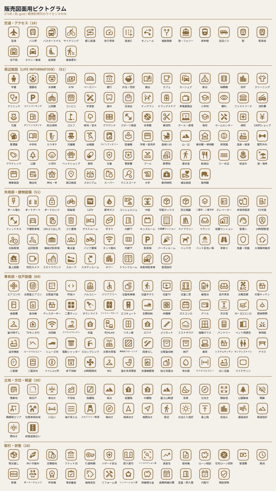

# 販売図面用ピクトグラム

センチュリー21 ラスターハウスの販売図面（マイソク）で使うピクトグラム一式。
物件データを渡すと、その物件の特徴に合うものが**自動で選ばれる**。



## 中身

| パス | 内容 |
|---|---|
| `catalog.json` | 275項目の対応表。`key`(正規名) / `label`(表示名) / `icon`(Iconify ID) / `match`(日本語の表記ゆれ) / `cat`(分類) |
| `svg/` | 275点のSVG（`currentColor` なので好きな色で使える） |
| `png/sumi/` | 墨 `#1E2328`（本文と同じ色） |
| `png/gold/` | 金 `#8C6E3F`（見出し・罫と同じ色） |
| `png/gold_light/` | 淡金 `#BEAF87` |
| `png/white/` | 白（写真の上に載せる用） |
| `contact_sheet.png` | 全点の一覧（金）／`contact_sheet_sumi.png`（墨） |
| `LICENSES.md` | 採用したアイコンセットとライセンス |

スクリプトの置き場所:

| スクリプト | 役割 |
|---|---|
| `scripts/build_pictograms.py` | Iconifyから素材を作り直す（このディレクトリの生成元） |
| `scripts/make_contact_sheet.py` | 一覧画像を作り直す |
| `scripts/preview_layout.py` | PPTXを1枚のPNGに素描きしてレイアウトを目で確認する |
| `skills/property-mysoku-generator/scripts/pick_pictograms.py` | 物件データから使うピクトグラムを選ぶ |
| `skills/property-mysoku-generator/scripts/place_pictograms.py` | 販売図面PPTXの行頭に実際に差し込む |

実際に図面へ入れるスクリプトはスキル配下にある。スキルには
**`atlas.png` 1枚**（275点の形を17×17に並べたもの・271KB）と `catalog.json` だけを同梱し、
色は使うときにPILで着ける。1点1ファイルにすると275ファイルになり、
スキルを配るときのファイル数上限（200）を超えてしまうため。
このディレクトリはSVGと4色PNGを持つマスターで、素材を作り直すときに使う。

```bash
# スキル同梱分を作り直す
python scripts/build_pictograms.py --size 128 --png-only --atlas \
       --out skills/property-mysoku-generator/assets/pictograms
```

色は販売図面テンプレート（アトラスタワー五反田30F）のXMLから実測したブランド色。
PNGは256px。A4横の図面で使う0.35〜0.8cmの枠なら300dpiでも十分足りる。

**全点、絵と同じ色の角丸枠で囲ってある。** 販売図面では設備アイコンを枠に入れるのが
通例で、写真や地の上に置いても1点ずつ独立して見える。枠なしが要るときは
`build_pictograms.py --no-frame` で作り直せる。

## 分類（275点）

| 分類 | 点数 | 例 |
|---|---|---|
| 交通・アクセス | 18 | 駅／地下鉄／バス停／複数路線／新幹線／急行停車／駅直結／乗換便利 |
| 周辺施設（LIFE INFORMATION） | 81 | スーパー／コンビニ／ドラッグストア／総合病院／小児科／小学校／学童／商店街／温泉・銭湯 |
| 共用部・建物設備 | 51 | オートロック／宅配ボックス／ゲストルーム／キッズルーム／スカイラウンジ／機械式駐車場／防災備蓄 |
| 専有部・住戸設備 | 69 | 食洗機／ディスポーザー／床暖房／アイランドキッチン／ルーフバルコニー／天井高／和室／メゾネット |
| 立地・方位・眺望 | 30 | 角住戸／最上階／南向き／東向き／富士山眺望／スカイツリー眺望／高台／再開発エリア |
| 取引・状態 | 26 | 新築／築浅／リノベーション済／空室・即入居／オーナーチェンジ／住宅ローン控除／瑕疵保険 |

## 使い方

### 物件データから自動で選ぶ

```bash
python skills/property-mysoku-generator/scripts/pick_pictograms.py 物件_data.json --color gold -o 物件_pictograms.json
```

実際の物件（アトラスタワー五反田30F）で走らせた結果:

```
── LIFE INFORMATION 行のアイコン ──
   ✅ SPOT1: まいばすけっと 西五反田2丁目店  → スーパー
   ✅ SPOT2: ファミリーマート 西五反田二丁目店  → コンビニ
   ✅ SPOT3: トモズ 五反田店  → ドラッグストア
   ✅ SPOT4: 品川区立 第一日野小学校  → 小学校

── 物件の特徴ピクトグラム（12件・gold）──
   ✅ タワー      ← POINT2「タワー・地上30階」
   ✅ 最上階      ← POINT2「最上階」 / CATCH1「最上階」
   ✅ 富士山眺望   ← POINT2「富士山」 / CATCH2「富士山」
   ✅ コンシェルジュ ← POINT4「コンシェルジュ」
   …
```

拾い方は3系統:

1. **LIFE INFORMATION の各行**（`SPOT1`〜`SPOT7`）— 施設名から種別を判定して1行1アイコン。
   チェーン名（まいばすけっと・トモズ・ファミマ等）も登録済み。当たらない場合は汎用ピンにする。
2. **自由文**（`POINT1`〜`POINT6` / `NOTE` / `CATCH` / `STRUCTURE` 等）— 特徴語で拾う。
3. **有無で決まる項目**（`PET` / `ELEVATOR` / `PARKING` / `TRUNK`）— 値を見て判定。

### 販売図面に差し込む

```bash
python skills/property-mysoku-generator/scripts/place_pictograms.py 図面.pptx -o 図面_icon.pptx
python skills/property-mysoku-generator/scripts/place_pictograms.py 図面.pptx -o out.pptx --zones point,note,life --color sumi
python skills/property-mysoku-generator/scripts/place_pictograms.py 図面.pptx --dry-run          # 置く場所だけ見る
```

入れる場所は3か所。**帯や枠は増やさない**。`layout-rules.md` の
「新しい意匠を勝手に足さない」に沿って、既にあるものの中に納める。

| ゾーン | 場所 | やること |
|---|---|---|
| `point` | POINT本文の行頭 | 行頭の「・」を**ピクトグラムに置き換える**（字数は増えない） |
| `note` | 備考本文の行頭 | 同上 |
| `life` | LIFE INFORMATION の施設名の左 | アイコン分だけ字下げする |

既定は `point,note`。`life` は行が詰まっている図面だと文字を 8.0pt まで
小さくしないと入らないので、明示的に指定したときだけ実行する。

アトラスタワー五反田30Fの図面で実行した結果:

```
■ point（POINT）
   ✅ 複数路線    路線        ← 「・4駅９路線使える利便性」
   ✅ 富士山眺望   富士山       ← 「・お部屋から東京タワー、富士山へ抜ける眺望」
   ✅ タワー     タワーレジデンス  ← 「・2024年1月築の新築未入居・築浅タワーレジデンス…」
   ✅ 最上階     プレミアムフロア  ← 「・プレミアムフロア・資産性抜群」
■ note（備考）
   ※ 本文が 1 行増えます（下に 0.47cm の余白あり）
   ✅ 新築 / 空室・即入居 / 全居室収納
■ life（LIFE INFORMATION）
   ※ 距離欄を 0.05cm 詰めて施設名の欄を 5.25cm に広げました
   ※ 幅を作るため文字を 8.5→8.0pt にしました（下限 8.0pt・距離欄も同じ）
   ✅ スーパー / コンビニ / ドラッグストア / 小学校
```

**溢れそうなら止まる。** アイコン分だけ本文が狭くなるので、行が増えるかどうかを
先に計算する。増える場合は
①本文ボックスの下に余白があるならそのまま伸ばす →
②無ければアイコンを小さくして収める（下限0.26cm）→
③それでも無理なら**エラーで止める**。黙って溢れさせない。
承知のうえで進めるときだけ `--force`。

文字を縮めるのは `life` だけで、下限は **8.0pt**（A4原寸で読める大きさ）。
これ以上は縮めずに止まる。

置いた画像には `PICTO:キー` という名前が付くので、**何度掛け直しても増えない**
（前回の分を消してから置き直す）。

### 出来上がりを目で確認する

LibreOffice が入っていない環境でも、PPTXを1枚のPNGにして確認できる。

```bash
python scripts/preview_layout.py 図面_icon.pptx -o preview.png --dpi 150
python scripts/preview_layout.py 図面_icon.pptx -o point.png --dpi 300 --crop 0.3,10.0,11.0,15.9
```

写真は埋め込み画像をそのまま描き、文字は同梱の Noto Serif JP で組む。
本番フォントは HGS明朝E だが、全角が1emなのは同じなので**折り返し位置の確認には使える**。
字形そのものの再現ではないので、最終確認は PowerPoint で開いて行うこと。

### 「無い設備」を出さない仕組み

物件概要が「不可・無・なし」なら、そのピクトグラムは**拒否**される。
POINT文に「ペット可」と書いてあっても、概要が `PET=不可` なら出さない。

> 他社図面のPOINTを丸写しすると別物件の残骸（設備・戸数・築年）が混じる、という
> `content-rules.md` の警告に対応したもの。事実と違う設備アイコンは出さない。

```
── 物件概要が「無」なので出さなかったもの ──
   ⛔ pet_ok    (PET=不可)
   ⛔ elevator  (ELEVATOR=無)
   ⛔ parking   (PARKING=無（近隣に月極有）)
```

### 1行に1つだけ選ぶときの優先順位

行頭アイコンは1行1枚なので、複数当たったときは
**`rank` の高いもの → ヒットした語が長いもの** の順に選ぶ。
`rank`（既定1）は `catalog.json` の任意項目で、売りになる特徴に 2 を付けてある
（最上階・角住戸・富士山眺望・夜景・タワー・新築・リフォーム済・空室）。

> 「お部屋から東京タワー、富士山へ抜ける眺望」は
> タワー／眺望／富士山／夜景の4つが当たるが、**富士山眺望**を選ぶ。

同じ絵が1枚の図面で二度出ないよう、既に使ったキーは後回しになる。

### 施設名が当たらないとき

`catalog.json` の該当項目の `match` に語を足すだけ。再ビルドは不要
（`match` はピック時にしか使わない）。

### アイコンを増やす・差し替える

`catalog.json` に項目を足すか `icon` を書き換えて、再生成する:

```bash
python scripts/build_pictograms.py            # @iconify/json を取得して生成
python scripts/make_contact_sheet.py          # 一覧を作り直す
```

`build_pictograms.py` は**商用利用できないライセンスのセットを自動で弾く**
（MIT / Apache / CC0 / ISC / BSD / Unlicense のみ通す）。
CC BY-NC・CC BY-SA・GPL のセットを指定するとエラーで止まる。

## 出どころ

[Iconify](https://iconify.design/) の `@iconify/json`（236セット・334,712点）から、
商用利用可の304,084点を候補として、販売図面に必要な275点を選んだもの。
基調は **Material Symbols Outlined**（Apache-2.0・Google）。
無いものだけ **Material Design Icons**（Apache-2.0）で補完している。

詳細は [LICENSES.md](LICENSES.md)。
